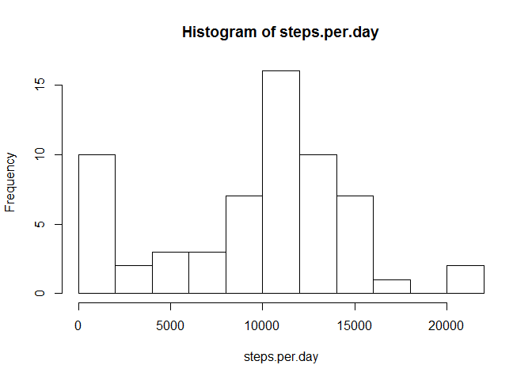
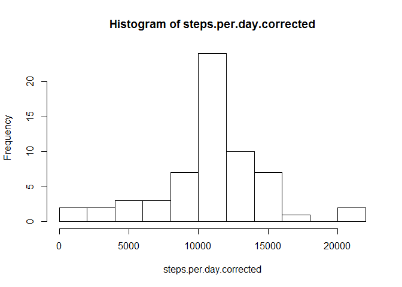
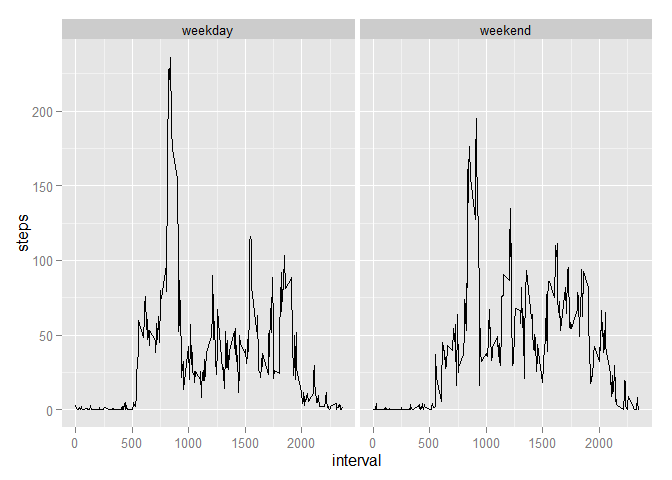

# Reproducible Research: Peer Assessment 1


## Loading and preprocessing the data
First, we load the CSV data from within the zip file:

```r
activity <- read.csv(unz("./activity.zip", "activity.csv"))
```

The CSV data already has given names to the columns, so we don't need to do that anymore:

```r
colnames(activity)
```

```
## [1] "steps"    "date"     "interval"
```

Although NA values exist, we don't need to remove them - aggregate functions can ignore them via the `na.rm` option.

With 5-minute intervals, we expect around 288 measurements each day (60 minutes * 24 hours = 1440 minutes a day, 1440 / 5 = 288). This appears to be true.

```r
activity.20121001 <- activity[(activity$date=='2012-10-01'),]
length(activity.20121001[,1])
```

```
## [1] 288
```

## What is mean total number of steps taken per day?
In order to calculate the mean total number, we first calculate the total number of steps per day.

```r
steps.per.day <- tapply(activity$steps, activity$date, FUN=sum, na.rm = TRUE)
```

In order to have a good overview of the number of steps taken each day, we visualise it inside a histogram:

```r
hist(steps.per.day,breaks=10)
```

 


```r
steps.median <- median(steps.per.day)
steps.mean <- mean(steps.per.day)
```

By calculating the median we can see that the subject takes around 10395 steps on an average day, 
with a mean of 9354.2295082.

## What is the average daily activity pattern?
To gain insight in the average daily activity pattern, it's good to first have a general understanding about the shape
of the data. We will do this by plotting the mean per interval.

```r
ggplot(activity, aes(x=interval, y=steps)) + 
  stat_summary(fun.y=mean, geom=c("line"))
```

```
## Warning: Removed 2304 rows containing missing values (stat_summary).
```

 

This shows a peak around 8:00 AM.  
Further investigation shows us the exact time, and the average number of steps recorded at this particular time:

```r
steps.per.interval <- aggregate(activity$steps, by=list(interval=activity$interval), FUN=mean, na.rm=TRUE)
colnames(steps.per.interval) <- c("interval", "mean_steps")
max_steps <- steps.per.interval[which.max(steps.per.interval$mean_steps),]
```
The maximum average number of steps are 206.1698113, recorded at 835.

## Imputing missing values
In this dataset, there are a number of missing values:

```r
activity$missing_value <- is.na(activity$steps)
num_missing <- sum(activity$missing_value)
num_missing
```

```
## [1] 2304
```
These 2304 missing values can mean several things:

* device switched deliberately off, for example because the person was sleeping
* errors in measurement
* device switched accidentally off, for example because the battery was low

In some of these occasions, ignoring the values are correct (for example, when sleeping, no steps should
be recorded indeed). For other occasions however could skew the conclusions (a low battery or incorrect measurement).

In order to get insight in the deviations introduced by absent measurements, we'll construct a second dataset. 
This dataset will be based on the original dataset, but the `NA` values will be filled in by the mean of all 
observations.

```r
activity$new_steps <- sapply(activity$steps, function(x) ifelse(is.na(x), mean(activity$steps, na.rm=TRUE), x))
```


Now let's recreate the histogram, and recalculate the `mean` and `median`

```r
steps.per.day.corrected <- tapply(activity$new_steps, activity$date, FUN=sum, na.rm = TRUE)
hist(steps.per.day.corrected,breaks=10)
```

 

At first glance, the shape can be recognized as the first histogram drawn above. However, giving it a second look
we can see that the median is stronger now (occurs far more often), and the peak at zero is almost gone. Extremes
are counting less.


```r
steps.median.corrected <- median(steps.per.day.corrected)
steps.mean.corrected <- mean(steps.per.day.corrected)
```
The median is now 1.0766189\times 10^{4} which by now is the same as the mean - 1.0766189\times 10^{4}. This is
to be expected: with the mean occuring more than 2000 times extra inside the dataset, this value is most likely the #1
candidate for the new median.

## Are there differences in activity patterns between weekdays and weekends?
In order to study the difference in activity patterns between weekdays and weekend, we add a new factor variable to 
the `activity` dataset. Because of locale differences we will *not* use the `weekdays` function, but `format` will do:

```r
activity$weekdaynumbers <- as.numeric(format(as.Date(activity$date), "%w"))
activity$isWeekend <- ifelse(activity$weekdaynumbers %% 6 > 1, "weekday", "weekend")
```

Now we'll make a panel plot to show the differences between weekend and weekdays:

```r
ggplot(activity, aes(x=interval, y=steps, group=isWeekend)) + 
  stat_summary(fun.y=mean, geom=c("line")) +
  facet_wrap( ~ isWeekend)
```

```
## Warning: Removed 1152 rows containing missing values (stat_summary).
```

```
## Warning: Removed 1152 rows containing missing values (stat_summary).
```

 

It is visible that during weekdays the activity level is more concentrated in a few peaks, whereas during 
weekends it is more spread out. Also, the overall activity level during weekdays is higher dan it is during weekends.
